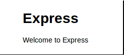

## "Hello World"

1. Install Node.js

	> For Mac or Windows use the installers from http://nodejs.org/download/
	> For most Linux distributions use the package instructions from https://github.com/joyent/node/wiki/Installing-Node.js-via-package-manager

2. Pick An Editor
  
  For some this is a religious decision, but here a few that work in case you are not already attached:

  	* Mac: [TextMate](http://macromates.com/), [Sublime](http://www.sublimetext.com/)
  	* Windows: [Sublime](http://www.sublimetext.com/), Notepad
  	* Linux: [Sublime](http://www.sublimetext.com/), GEdit (Gnome)

3. Create a directory called "hello-world"

		% mkdir hello-world

4. Change into the new directory

		% cd hello-world

5. Create a file called app.js

6. Enter the following code into the app.js file

  	var http = require('http');

		http.createServer(function (req, res) {
		  res.writeHead(200, {'Content-Type': 'text/plain'});
		  res.end('Hello World\n');
		}).listen(3000, '127.0.0.1');
			
		console.log('Server running at http://127.0.0.1:3000/');

7. Save the app.js file and open a command prompt or terminal window

8. Run the server

		% node app.js

9. Visit the [http://localhost:3000](default route) of the server in your browser		

		

## "Hello World" With Express

1. Install the Expresss module

		% [sudo] npm install -g express

2. Create a directory called "hello-world-express"

		% mkdir hello-world-express

3. Change into the new directory

		% cd hello-world-express

4. Create a new "Express" application inside this new directory

		% express .

5. Install dependencies from NPM

		% npm install

6. Run the server

		% node app.js

7. Visit the [http://localhost:3000](default route) of the server in your browser. You should see the default home page for Express:

		